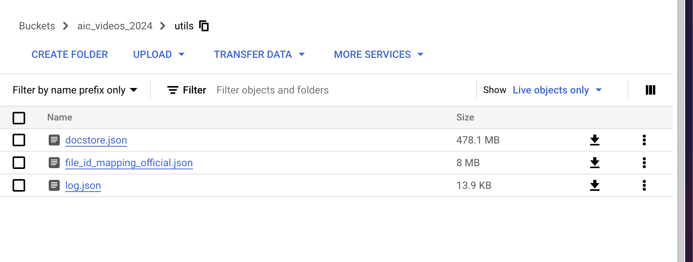
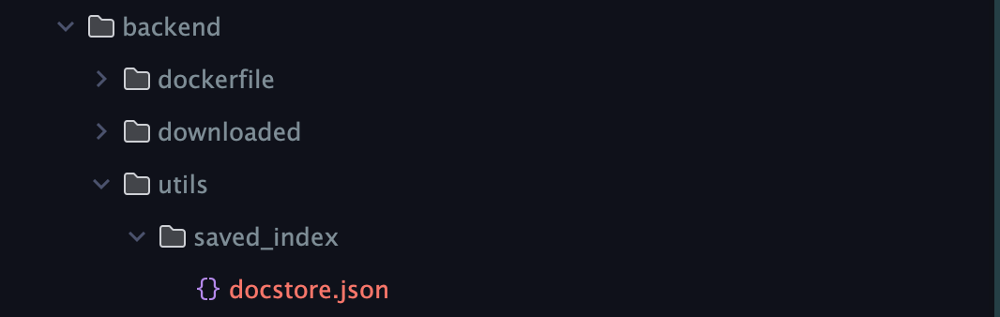
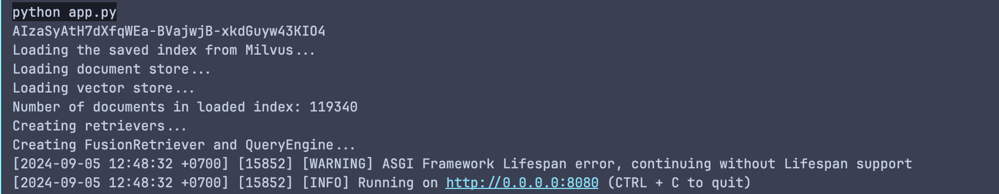

**Go to google cloud store storage to download docstore.json file**
 
**Then put it in ./backend/utils/saved_index directory**

**cd backend --> Run pip install -r requirements.txt in terminal**

**Create a new terminal --> cd backend --> run python app.py in the terminal to deploy backend**
